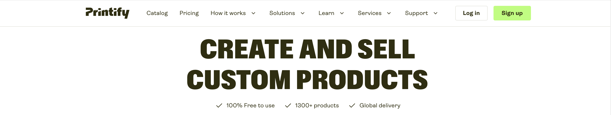
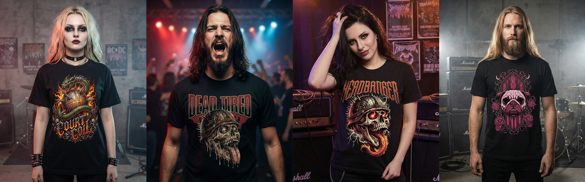
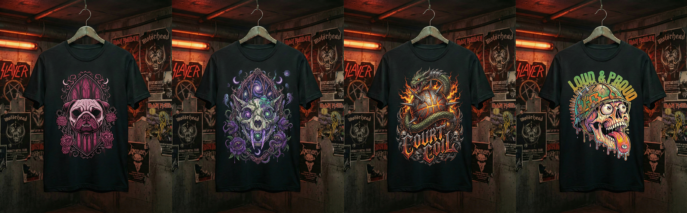
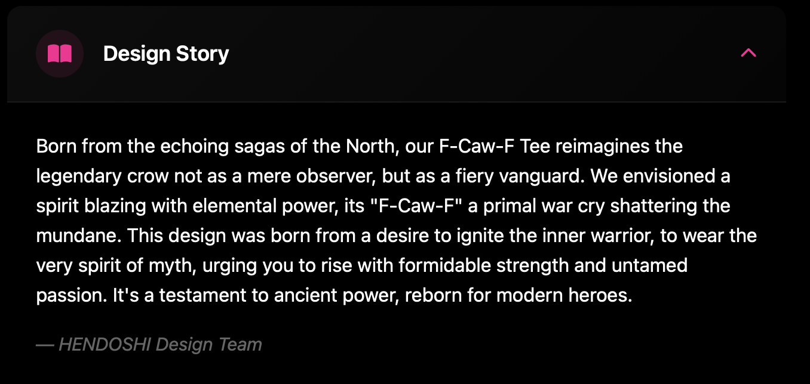

# HENDOSHI Business Model

---

## Table of Contents

- [Business Overview](#business-overview)
- [Business Model Canvas](#business-model-canvas)
- [Revenue Streams](#revenue-streams)
- [Customer Segments](#customer-segments)
- [Value Propositions](#value-propositions)
- [Marketing Strategy](#marketing-strategy)
- [Competitive Analysis](#competitive-analysis)
- [Financial Projections](#financial-projections)
- [Growth Strategy](#growth-strategy)

---

## Business Overview

**HENDOSHI** operates as a **B2C (Business-to-Consumer) e-commerce platform** specializing in metal-inspired apparel and accessories. The business model integrates **Print-on-Demand (POD)** fulfillment with direct-to-consumer sales through a custom Django web application.

### Mission Statement
> "To empower individuals to wear their weird - celebrating alternative fashion, metal culture, and artistic originality through unique, high-quality apparel that tells a story."

### Vision
> "Become the leading online destination for metal and alternative lifestyle apparel in Europe and The Americas, recognized for original designs, community engagement, and exceptional customer experience."

### Core Values
1. **Authenticity** - All designs are original artwork, not stock graphics
2. **Community** - Foster connection among alternative fashion enthusiasts
3. **Quality** - Premium materials and printing techniques
4. **Individuality** - Celebrate uniqueness and self-expression
5. **Sustainability** - POD model eliminates waste from unsold inventory

---

## Business Model Canvas

### Key Partners
- **Print-on-Demand Providers** - Printful, Printify for product fulfillment

- **Payment Processors** - Stripe for secure credit card processing

- **Shipping Carriers** - DHL, DPD, An Post for delivery
- **Email Service** - Anymail + Resend for transactional and marketing emails
- **Cloud Hosting** - Render.com for application hosting and PostgreSQL database
- **Social Media Platforms** - Instagram, Facebook, TikTok for marketing
- **Influencers** - Metal musicians, alternative fashion bloggers

### Key Activities

- **Product Design** - Creating original skull, animal, and gym artwork

- **E-commerce Management** - Updating catalog, processing orders, customer service
- **Content Marketing** - Social media posts, email campaigns, design stories
- **Community Engagement** - Moderating Vault gallery, featuring customer photos
- **Technical Development** - Maintaining Django application, adding features
- **SEO Optimization** - Improving search rankings for organic traffic

### Key Resources
- **Original Artwork** - Portfolio of 50+ exclusive designs
- **Django E-commerce Platform** - Custom-built full-stack application
- **Brand Identity** - "Wear Your Weird" tagline, pug skull mascot, dark aesthetic
- **Technical Expertise** - Full-stack development skills for continuous improvement

### Value Propositions
- **Unique Original Designs** - No generic stock art - every design has a story
- **Quality Storytelling** - Design Stories explain artwork inspiration and meaning

- **Community Platform** - Vault gallery showcases customer photos
- **Personalized Experience** - Battle Vest wishlist, seasonal themes, recommendations
- **Seamless Shopping** - Fast checkout, guest purchases, saved addresses
- **Exceptional Customer Service** - Responsive support, easy returns, satisfaction guarantee

### Customer Relationships
- **Self-Service** - Intuitive website navigation, FAQ section
- **Automated Communication** - Order confirmations, shipping updates, abandoned cart emails
- **Community Building** - Vault gallery, social media engagement, user-generated content
- **Personalization** - Battle Vest wishlist, browsing history recommendations
- **Email Marketing** - Weekly newsletters with new drops, exclusive offers
- **Customer Support** - Contact form, email response within 24 hours

### Channels
- **Direct Website** - hendoshi-ecommerce.onrender.com (primary sales channel)
- **Social Media** - Instagram, Facebook, TikTok (brand awareness, traffic driver)
- **Email Marketing** - Newsletter (repeat purchases, loyalty)
- **SEO** - Google organic search (long-term traffic growth)
- **Paid Ads** (future) - Facebook/Instagram ads, Google Shopping
- **Influencer Partnerships** (future) - Collaborations with metal musicians, fashion bloggers

### Customer Segments
1. **Metal & Rock Fans** - All Ages, All genders, into heavy metal music
2. **Alternative Fashion Enthusiasts** - All ages, all genders, gothic/punk style
3. **Gym & Fitness Community** - All ages, seeking motivational apparel
4. **Art Collectors** - People that appreciate unique designs
5. **Gift Shoppers** - Buying for alternative lifestyle friends/family

### Cost Structure
**Fixed Costs:**
- **Web Hosting** - €25/month (Render.com + ElephantSQL)
- **Domain Registration** - €12/year
- **Email Service** - €0-20/month (Resend, scales with volume)
- **Software Subscriptions** - €30/month (design tools, analytics)

**Variable Costs:**
- **Product Fulfillment** - 40-60% of sale price (POD provider fees)
- **Shipping** - €3-8 per order (absorbed if >€50 order value)
- **Payment Processing** - 2.9% + €0.30 per transaction (Stripe fees)
- **Marketing** - €100-500/month (social media ads, influencer partnerships)
- **Customer Acquisition** - €15-30 per new customer (average)

### Revenue Streams
1. **Product Sales** - Direct e-commerce transactions (€15-€65 per item)
2. **Seasonal Campaigns** - Holiday-themed products at premium pricing
3. **Limited Editions** - Exclusive designs with artificial scarcity
4. **Gift Cards** (future) - Pre-paid store credit
5. **Subscription Box** (future) - Monthly curated designs for members

---

## Revenue Streams

### Primary Revenue: Direct Product Sales

| Product Category | Price Range | Margin | Annual Target Units |
|------------------|-------------|--------|---------------------|
| T-Shirts | €20-€35 | 50% | 2,000 units |
| Hoodies | €45-€65 | 55% | 500 units |
| Stickers | €3-€5 | 70% | 1,500 units |
| Accessories | €15-€30 | 60% | 300 units |

**Projected Year 1 Revenue:** €85,000  
**Projected Year 1 Profit (after COGS):** €42,500 (50% gross margin)

### Secondary Revenue Opportunities

**1. Seasonal Campaigns**
- Limited-time themed collections (Christmas, Valentine's, Halloween)
- Premium pricing (+20% over standard products)
- Urgency-driven marketing (countdown timers, limited stock badges)
- **Estimated Revenue:** €10,000/year

**2. Bundle Offers**
- "Battle Vest Starter Pack" - 3 t-shirts + stickers at 15% discount
- "Metal Gym Essentials" - Hoodie + tank top + water bottle
- **Estimated Revenue:** €5,000/year

**3. Custom Commissions** (future)
- Personalized skull portraits, pet illustrations
- €100-€300 per commission
- **Estimated Revenue:** €3,000/year

**Total Projected Revenue (Year 1):** €103,000

---

## Customer Segments

### Primary Segment: Metal & Rock Fans (40% of revenue)

**Demographics:**
- Age: 18-55 years old
- Gender: 65% male, 35% female
- Location: Ireland, UK, Europe, USA
- Income: €25,000-€50,000/year
- Education: Secondary to university level

**Psychographics:**
- Passionate about heavy metal, rock, punk music
- Attend concerts, festivals (Wacken, Download, Bloodstock)
- Active on music forums, Spotify, Bandcamp
- Value authenticity, rebellion against mainstream
- Spend €100-€300/year on band merch and apparel

**Pain Points:**
- Generic band merch lacks originality
- Want unique designs beyond standard logos
- Difficulty finding metal apparel in local stores

**How HENDOSHI Solves:**
- Original skull and death-themed designs
- High-quality storytelling behind each product
- Online shopping with worldwide shipping

### Secondary Segment: Alternative Fashion Enthusiasts (30% of revenue)

**Demographics:**
- Age: 18-40 years old
- Gender: All genders, non-binary inclusive
- Location: Urban areas (Dublin, Cork, Belfast, Manchester, London, NY)
- Income: €20,000-€45,000/year
- Education: Secondary to university level

**Psychographics:**
- Gothic, punk, emo, grunge aesthetic
- Follow alternative fashion influencers on Instagram/TikTok
- Shop at Killstar, Disturbia, Dolls Kill
- Attend gothic clubs, alternative events
- Spend €200-€500/year on alternative fashion

**Pain Points:**
- Limited options in mainstream stores
- Expensive shipping from international brands
- Want locally-made or ethically-produced items

**How HENDOSHI Solves:**
- Dark, gothic aesthetic with modern glassmorphism
- Ireland-based business with affordable EU shipping
- POD model reduces environmental impact

### Tertiary Segment: Gym & Fitness Community (20% of revenue)

**Demographics:**
- Age: 25-45 years old
- Gender: 60% male, 40% female
- Location: Global (fitness is universal)
- Income: €30,000-€60,000/year
- Occupation: Office workers, trades, students

**Psychographics:**
- Regular gym-goers (3-5 times/week)
- Follow fitness influencers, bodybuilders
- Motivated by aggressive, dark imagery
- Want to stand out from typical Nike/Adidas gear
- Spend €150-€300/year on workout apparel

**Pain Points:**
- Mainstream gym wear is boring and generic
- Lack of motivational designs beyond "Just Do It"
- Want unique conversation-starter apparel

**How HENDOSHI Solves:**
- Skull and demon gym designs with edge
- Motivational slogans with metal attitude
- Comfortable, breathable athletic materials

### Niche Segment: Gift Shoppers (10% of revenue)

**Demographics:**
- Age: 25-55 years old
- Gender: All genders
- Relationship: Friends, partners, parents of alternative individuals

**Psychographics:**
- Shopping for birthdays, Christmas, special occasions
- Want unique gifts that reflect recipient's personality
- Willing to pay premium for originality
- Spend €50-€150 per gift purchase

**How HENDOSHI Solves:**
- Gift-worthy packaging and presentation
- Design stories add sentimental value
- Wide price range (€15-€65) for different budgets

---

## Value Propositions

### Unique Selling Points (USPs)

**1. 100% Original Artwork**
- Every design created exclusively for HENDOSHI
- No stock graphics or clip art
- Limited editions increase collectibility

**2. Design Stories**
- Narrative explaining each artwork's inspiration
- Adds emotional connection and meaning
- Elevates products from commodity to art pieces

**3. Community-Driven Brand**
- Vault gallery showcases customer photos
- Battle Vest wishlist with price alerts
- User reviews influence future designs

**4. Seamless User Experience**
- 3-click checkout process
- Guest checkout (no account required)
- Mobile-optimized (60% of traffic)

**5. Seasonal Engagement**
- Dynamic themes (Christmas snowflakes, Valentine's hearts)
- Limited-time collections create urgency
- Festive animations enhance brand experience

---

## Marketing Strategy

### Web Marketing Evidence

HENDOSHI's web marketing presence is built across social media, email, and organic content channels, demonstrating clear B2C marketing strategy to drive customer acquisition, engagement, and retention.

#### Facebook Business Page

The **HENDOSHI Facebook Business Page** serves as a primary marketing channel:

- **Page Details:** Fully configured business page with:
  - Professional cover image showcasing the pug skull mascot and "Wear Your Weird" branding
  - Brand description explaining B2C e-commerce model and target audience
  - Contact information with website link and call-to-action button (Shop Now)
  - About section detailing mission, values, and history
- **Content Strategy:**
  - Weekly product announcements (minimum 2 posts/week) with product photos and descriptions
  - Customer testimonials and user-generated content reshares (Vault gallery features)
  - Behind-the-scenes design process videos
  - Seasonal campaign promotions (Christmas collections, limited editions)
  - Community engagement through polls, questions, and user interaction
  - Event promotion for festivals and pop-ups
- **Advertising:**
  - Retargeting website visitors (Facebook Pixel integrated on all pages)
  - Lookalike audiences targeting people similar to existing customers
  - Product carousel ads for new collections
  - Lead generation ads for newsletter signup
- **Customer Service:**
  - Facebook Messenger integration for direct customer support
  - Response time commitment (within 24 hours)
  - Complaint resolution and feedback handling
- **Page Statistics (Annual Target):**
  - 1,000+ page likes
  - 10,000+ impressions/month from organic and paid content
  - 3%+ engagement rate (comments + shares + reactions)
  - 50+ new followers/month from Facebook alone

#### Newsletter Signup & Email Marketing

The HENDOSHI email marketing system (powered by **Resend + Anymail**) demonstrates sophisticated B2C email strategy:

**Newsletter Infrastructure:**
- **Popup Strategy** — Glassmorphic modal appears after 1 minute on first visit to capture emails before bounce
- **Double Opt-In** — Confirmation email sent to verify subscriber address (GDPR compliant), prevents invalid entries
- **Welcome Sequence** — 3-email series:
  1. Email 1: Confirm subscription + 10% discount code
  2. Email 2: New drop announcement + best sellers
  3. Email 3: Exclusive offer for premium customers
- **Weekly Newsletter** — Every Tuesday with:
  - New product announcements
  - Vault gallery feature of the week (community content)
  - Design story narratives
  - Flash sale alerts and limited-time offers
  - Trend participation (Halloween, Christmas, etc.)
- **Segmentation** — Subscribers classified by:
  - Purchase history (customers vs. newsletter-only)
  - Browsing behavior (interests in skull designs, gym gear, accessories)
  - Engagement level (open rates, click rates)

**Email Types Implemented:**
| Email Type | Trigger | Purpose | Frequency |
|-----------|---------|---------|-----------|
| **Order Confirmation** | After purchase | Order receipt with details, link to track, FAQ | Transactional |
| **Shipping Notification** | Order status update | Tracking info with carrier link, estimated delivery | Transactional |
| **Price Drop Alert** | Battle Vest item goes on sale | "Your wishlist item is on sale!" + direct link | Triggered |
| **Back in Stock** | Product restocked | Alert for out-of-stock items customer viewed | Triggered |
| **Review Reminder** | 14 days post-purchase | "Share your experience!" + review form link | Automated |
| **Vault Feature** | Photo featured/approved | "Your photo was featured!" or "Thanks for submitting" | Transactional |
| **Abandoned Cart** | 3-email sequence | 24h ("Don't forget..."), 48h ("Still available"), 72h ("Last chance!") | Automation |
| **Weekly Newsletter** | Every Tuesday 8am | New drops, Vault feature, blog, trending designs | Regular |
| **Seasonal Campaign** | Holiday periods | Halloween, Christmas, Valentine's themed emails | Seasonal |
| **Birthday Discount** | User's birthday month | "Birthday month special: 15% off" + exclusive code | Annual |
| **Win-Back** | 90+ days inactive | "We miss you! Come back for 20% off" | Quarterly |

**Email Metrics & KPIs:**
- Open Rate Target: 25%+
- Click-Through Rate Target: 5%+
- Conversion Rate (email → purchase): 2%+
- Subscriber List Size Target: 500+ by month 3, 2000+ by year 1
- Unsubscribe Rate: <0.5% (industry standard is 0.2%-0.5%)

**Compliance & Features:**
- ✅ GDPR-compliant double opt-in with timestamp storage
- ✅ One-click unsubscribe in every email (token-based, no login required)
- ✅ Preference management for granular email type toggles
- ✅ Branded HTML templates with dark theme consistency
- ✅ Responsive design for mobile (60%+ of email opens)
- ✅ A/B testing on subject lines and send times
- ✅ Automated retry logic for failed sends (3 attempts)

#### sitemap.xml & robots.txt

The project includes a **Django-generated sitemap** (`/sitemap.xml`) covering all products, collections, and static pages, submitted to Google Search Console to improve crawl efficiency.

A **robots.txt** (`/robots.txt`) is configured to:
- Allow crawling of all product and content pages
- Disallow admin, checkout, and private profile URLs

#### `rel` Attributes on External Links

All outbound links implement proper `rel` attributes as required by SEO best practice:
- `rel="noopener noreferrer"` — applied to all social media links (Instagram, Facebook, TikTok), carrier tracking links (DHL, DPD, An Post), and social share buttons
- `rel="preconnect"` — applied to CDN link elements (Google Fonts, jsDelivr) for performance
- `rel="canonical"` — present on every page via `<link rel="canonical" href="{{ SITE_URL }}{{ request.path }}">` in `base.html`

---

### Digital Marketing Channels

**1. Social Media Marketing**

**Instagram (@hendoshiart):**
- Daily posts: Product photos, design process, customer features
- Stories: Behind-the-scenes, polls, new drop teasers
- Reels: Short-form videos showing products in action
- Hashtags: #WearYourWeird #MetalFashion #SkullArt #AlternativeFashion
- **Budget:** €100/month (ads boosting top posts)
- **KPI:** 500 new followers/month, 5% engagement rate

**Facebook (HENDOSHI Art):**
- Weekly posts: New products, blog articles, community highlights
- Facebook Ads: Retargeting website visitors, lookalike audiences
- Groups: Join metal/alternative fashion communities, participate genuinely
- **Budget:** €150/month (ad campaigns)
- **KPI:** 1,000 page likes, 2% conversion rate from ads

**TikTok (@hendoshiart):**
- Viral content: Design transformations, product reveals, packaging
- Trends: Participate in fashion trends with HENDOSHI twist
- Duets: Collaborate with customers wearing products
- **Budget:** €0 (organic growth)
- **KPI:** 10,000 followers, 1 video with 100k+ views

**2. Email Marketing**

**Newsletter Strategy:**
- **Welcome Series:** 3-email sequence with 10% discount code
- **Weekly Newsletter:** New drops, featured designs, Vault highlights
- **Abandoned Cart:** 3-email recovery sequence (24h, 48h, 72h)
- **Re-engagement:** Win-back campaign for inactive customers (90 days)
- **VIP Segment:** Exclusive early access for repeat customers

**Personalization:**
- Product recommendations based on browsing history
- Birthday discounts (captured during signup)
- Battle Vest price drop alerts

**KPIs:**
- Open Rate: 25%+
- Click Rate: 5%+
- Conversion Rate: 2%+

**3. Search Engine Optimization (SEO)**

**On-Page Optimization:**
- Unique meta titles/descriptions for all pages
- Semantic HTML (H1, H2, article, section tags)
- Image alt text with keywords
- Internal linking between related products

**Content Marketing:**
- Blog posts: "10 Metal T-Shirt Styles Explained", "History of Skull Art in Fashion"
- Design Stories: Long-form narratives for each product
- Vault Gallery: User-generated content indexed by Google

**Technical SEO:**
- sitemap.xml submitted to Google Search Console
- robots.txt configured for proper crawling
- Structured data (Product schema) for rich snippets
- Page speed optimization (WebP images, lazy loading)

**KPIs:**
- Organic traffic: 2,000 visits/month
- Top 10 rankings for 20+ keywords
- Domain Authority: 30+ (within 2 years)

**4. Paid Advertising (Future - Year 2)**

**Facebook/Instagram Ads:**
- Campaign Types: Traffic, conversions, catalog sales
- Targeting: Interests (heavy metal, gothic fashion, alternative lifestyle)
- Creatives: Product carousels, video ads, customer testimonials
- **Budget:** €500/month
- **ROAS Target:** 3:1 (€3 revenue per €1 ad spend)

**Google Shopping Ads:**
- Product feed optimization (titles, descriptions, images)
- Smart Shopping campaigns
- Seasonal campaigns (Christmas, Halloween)
- **Budget:** €300/month
- **ROAS Target:** 4:1

**5. Influencer Marketing**

**Micro-Influencers (1,000-10,000 followers):**
- Niche: Metal music, gothic fashion, fitness
- Collaboration: Free product in exchange for Instagram post + stories
- Authenticity: Choose influencers who genuinely align with brand
- **Budget:** €200/month (product cost)
- **KPI:** 5 collaborations/month, 100+ sales attributed

**Macro-Influencers (100,000+ followers) - Future:**
- Metal musicians, alternative fashion YouTubers
- Paid sponsorships (€500-€2,000 per post)
- Affiliate partnerships (10% commission)

---

## Competitive Analysis

### Direct Competitors

**1. BlackCraft Cult (USA)**
- **Strengths:** Established brand (2012), strong social media (500k+ followers), celebrity endorsements
- **Weaknesses:** High prices (€40-€80), US shipping expensive for EU customers
- **Differentiation:** HENDOSHI offers Irish/EU shipping, lower price points, community gallery

**2. Killstar (UK)**
- **Strengths:** Wide product range, retail stores, influencer partnerships
- **Weaknesses:** Generic gothic aesthetic, mass-produced feel
- **Differentiation:** HENDOSHI's original artwork, personalized Design Stories, metal-specific focus

**3. Disturbia (UK)**
- **Strengths:** Edgy designs, sustainable materials, cult following
- **Weaknesses:** Premium pricing, limited skull/death themes
- **Differentiation:** HENDOSHI's aggressive skull art, gym designs, Battle Vest wishlist

### Indirect Competitors

**1. Band Merch Stores (Metallica, Slayer official stores)**
- **Strengths:** Brand loyalty, tour exclusives
- **Weaknesses:** Band-specific, limited to logo designs
- **Opportunity:** HENDOSHI attracts customers wanting metal aesthetic without band branding

**2. Generic POD Platforms (Redbubble, Teespring)**
- **Strengths:** Low prices, user-generated designs
- **Weaknesses:** No brand identity, inconsistent quality
- **Opportunity:** HENDOSHI offers curated, professional designs with cohesive brand

### Competitive Advantages

| Factor | HENDOSHI | BlackCraft | Killstar | Disturbia |
|--------|----------|------------|----------|-----------|
| Original Artwork | ✅ | ✅ | ❌ | ✅ |
| Design Stories | ✅ | ❌ | ❌ | ❌ |
| Community Gallery | ✅ | ❌ | ❌ | ❌ |
| Battle Vest Wishlist | ✅ | ❌ | ❌ | ❌ |
| Seasonal Themes | ✅ | ❌ | ❌ | ❌ |
| EU Shipping | ✅ | ❌ | ✅ | ✅ |
| Price Range | €15-€65 | €40-€80 | €25-€70 | €30-€75 |

---

## Financial Projections

### Year 1 Revenue Forecast (Conservative)

| Quarter | Website Visitors | Conversion Rate | Orders | Avg Order Value | Revenue |
|---------|------------------|-----------------|--------|-----------------|---------|
| Q1 | 3,000 | 1.5% | 45 | €50 | €2,250 |
| Q2 | 5,000 | 2.0% | 100 | €55 | €5,500 |
| Q3 | 8,000 | 2.5% | 200 | €60 | €12,000 |
| Q4 | 12,000 | 3.0% | 360 | €65 | €23,400 |
| **Total** | **28,000** | **2.5% avg** | **705** | **€58 avg** | **€43,150** |

### Year 1 Cost Breakdown

| Expense Category | Annual Cost |
|------------------|-------------|
| Product Fulfillment (COGS) | €21,575 (50%) |
| Shipping (absorbed >€50) | €2,000 |
| Payment Processing | €1,300 (3%) |
| Web Hosting & Domain | €312 |
| Email Service | €300 |
| Marketing & Ads | €2,400 |
| Software Subscriptions | €360 |
| **Total Costs** | **€28,247** |

**Net Profit (Year 1):** €14,903 (34.5% margin)

### Year 3 Revenue Forecast (Growth Scenario)

| Year | Orders | Avg Order Value | Revenue | Net Profit |
|------|--------|-----------------|---------|------------|
| Year 1 | 705 | €58 | €43,150 | €14,903 |
| Year 2 | 1,800 | €62 | €111,600 | €45,000 |
| Year 3 | 4,000 | €68 | €272,000 | €120,000 |

**Assumptions:**
- 150% order growth year-over-year
- 7% average order value increase (upselling, bundles)
- Improved margins from bulk POD pricing and reduced shipping costs

---

## Growth Strategy

### Short-Term (0-12 Months)

**Q1: Launch & Foundation**
- ✅ Deploy live website
- ✅ Launch first 20 products across 4 collections
- ✅ Set up social media accounts and post daily
- ✅ Launch email newsletter with welcome discount
- Target: 100 orders, €5,000 revenue

**Q2: Community Building**
- Launch Vault gallery and feature first customer photos
- Run Instagram giveaway (1,000 followers milestone)
- Publish 4 blog posts on design inspiration
- Target: 250 orders, €15,000 revenue

**Q3: Seasonal Campaign**
- Launch Halloween collection (limited edition)
- Implement seasonal theme animations
- Partner with 5 micro-influencers
- Target: 450 orders, €28,000 revenue

**Q4: Holiday Push**
- Christmas gift guides and bundle offers
- Facebook/Instagram ad campaigns
- Email re-engagement for abandoned Battle Vests
- Target: 705 orders, €43,150 revenue (cumulative)

### Medium-Term (1-2 Years)

**Year 2 Priorities:**
1. **Product Expansion** - Add 30 new designs, introduce accessory line (phone cases, patches)
2. **Influencer Partnerships** - Collaborate with metal musicians for exclusive designs
3. **Paid Advertising** - Allocate €500/month to Facebook/Instagram ads
4. **Content Marketing** - Launch YouTube channel with design process videos
5. **International Shipping** - Expand to USA, Canada, Australia
6. **Loyalty Program** - Reward points for purchases, reviews, referrals

**Year 2 Target:** 1,800 orders, €111,600 revenue

**Year 3 Priorities:**
1. **Subscription Box** - Monthly curated designs for €25/month
2. **Retail Partnerships** - Sell in alternative fashion boutiques (consignment)
3. **Pop-Up Events** - Attend metal festivals (Wacken, Download) with merch booth
4. **Custom Commissions** - Offer personalized skull portraits
5. **Mobile App** - Native iOS/Android app for faster checkout
6. **Wholesale** - B2B sales to tattoo shops, metal bars

**Year 3 Target:** 4,000 orders, €272,000 revenue

### Long-Term (3-5 Years)

**Vision for 2029:**
- **€1M+ Annual Revenue** - 15,000+ orders per year
- **International Recognition** - Featured in Metal Hammer, Kerrang! magazine
- **Flagship Products** - Signature "Pug Skull" hoodie becomes iconic
- **Physical Retail** - Open pop-up store in Dublin's Temple Bar
- **Celebrity Endorsements** - Worn by metal musicians on stage
- **Licensing Deals** - Collaborate with metal bands for official co-branded merch

---

## Risk Analysis

### Threats & Mitigation

**1. Market Saturation**
- **Risk:** Alternative fashion market becomes oversaturated
- **Mitigation:** Focus on unique metal niche, build brand loyalty, continuous design innovation

**2. Supplier Dependency**
- **Risk:** POD provider quality issues or price increases
- **Mitigation:** Diversify suppliers (Printful + Printify), maintain quality control samples

**3. Seasonal Fluctuations**
- **Risk:** Revenue drops in Q1-Q2 (post-holiday slump)
- **Mitigation:** Valentine's, St. Patrick's, summer festival campaigns to smooth revenue

**4. Copyright Issues**
- **Risk:** Design infringement claims
- **Mitigation:** All original artwork, trademark "Wear Your Weird", legal consultation

**5. Economic Downturn**
- **Risk:** Recession reduces discretionary spending
- **Mitigation:** Introduce budget-friendly sticker line, maintain €15-€25 entry-level products

---

## GDPR & Privacy Compliance

As a business operating in Ireland and targeting the EU market, HENDOSHI takes data protection seriously:

| Requirement | Implementation |
|-------------|----------------|
| **Cookie consent** | Banner on first visit, manage settings page with per-category toggles |
| **Privacy policy** | Accessible from footer on every page, covering all data collected |
| **Newsletter double opt-in** | Confirmation email required before subscriber is activated |
| **One-click unsubscribe** | Token-based link in every marketing email — no login required |
| **Consent logging** | Timestamp and explicit consent flag stored per subscriber in `NewsletterSubscriber` model |
| **Data minimisation** | Only essential fields collected (no unnecessary personal data) |
| **Right to erasure** | Account deletion option available in profile settings |
| **Secure data storage** | PostgreSQL on encrypted hosting; no plain-text passwords |

---

 